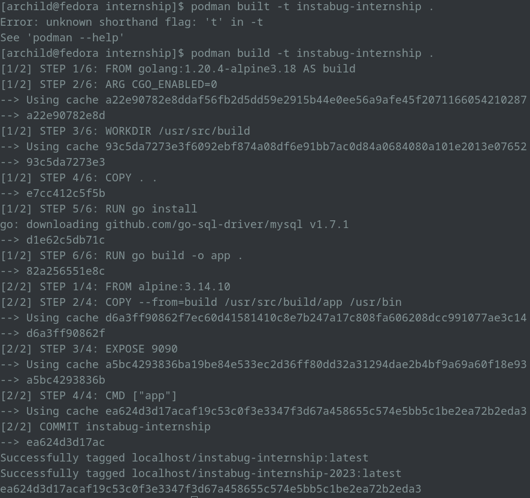
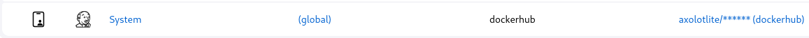
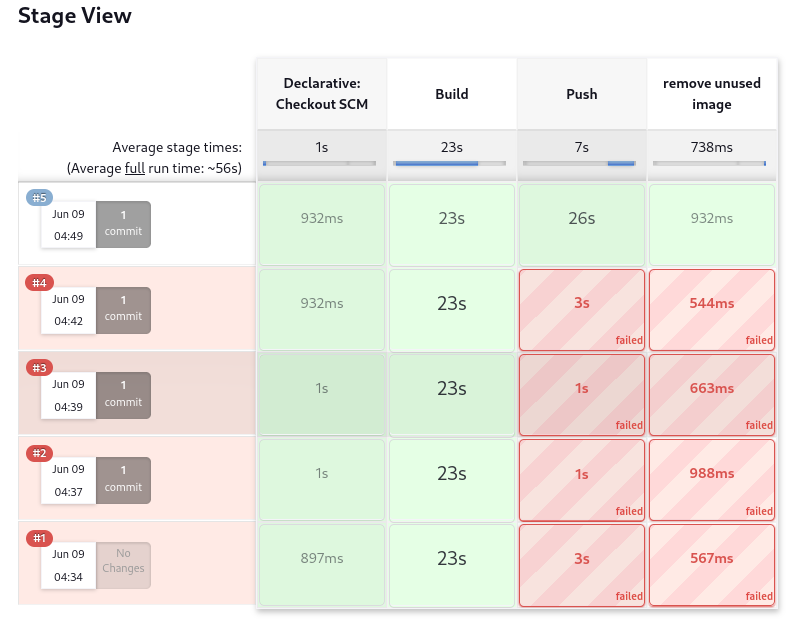
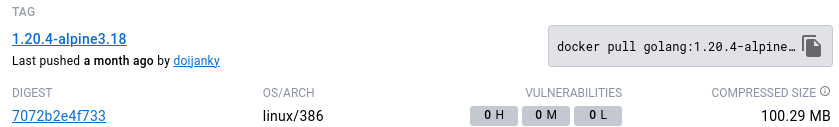
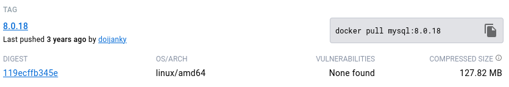
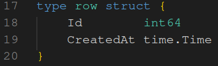
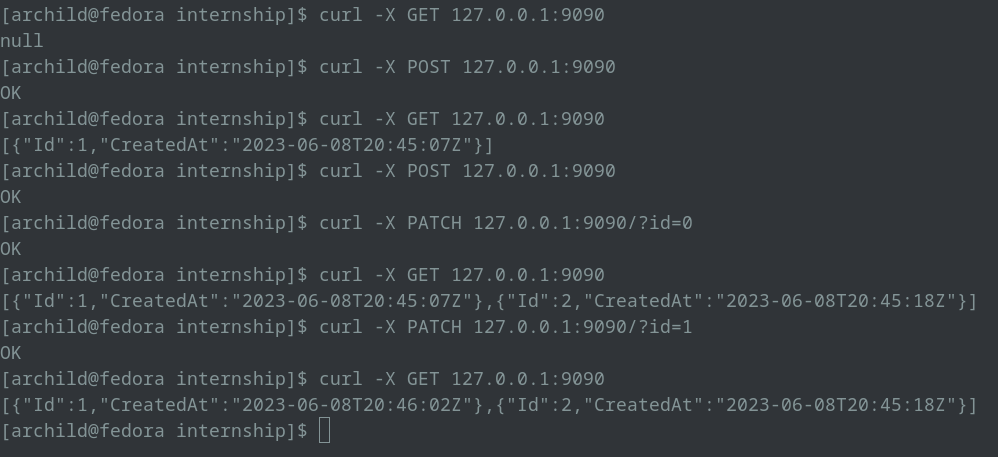

# Wow Such Program

This program is very simple, it connects to a MySQL database based on the following env vars:
* MYSQL_HOST
* MYSQL_USER
* MYSQL_PASS
* MYSQL_PORT

And exposes itself on port 9090:
* On `/healthcheck` it returns an OK message, 
* On GET it returns all recorded rows.
* On POST it creates a new row.
* On PATCH it updates the creation date of the row with the same ID as the one specified in query parameter `id`

Check this golang project in the attachment and create the following:
- [x] Dockerfile that build the app and try to make it as lightweight as you can.
	using multi-stages I've split the build into two stages
	build (346MB): creating a statically linked binary that should be executed almost anywhere
	app (13.2MB): which executes the binary using a light weight alpine container
	
- [x] Docker compose file that contains both application and mysql database so you can run the app locally.
- [x] Pipeline job (jenkinsfile) to build the app using dockerfile and reports if any errors happened in the build. The output of the build step should be a docker image pushed to dockerhub or any docker repo you want.
	after installing the docker pipeline and docker-step-pipeline plugins
	setting up your dockerhub credentials using jenkins
	
	The completed build
	
- [x] Helm manifests for kubernetes to deploy the app using them on kubernetes with adding config to support 
    minikube refuses to cooperate.

## Bonus:
- [ ] Add autoscaling manifest for number of replicas.
- [ ] Add argocd app that points to helm manifests to apply gitops concept.
- [ ] Secure your containers as much as you can.
	after looking through dockerhub for images with the least amount of vulnerabilities while meeting the project requirements of:
	golang >= 1.13: golang:1.20.4-alpine3.18
	
	mysql >= 4.1: mysql:8.0.18 (because mysql 8 is faster than 5)
	

- [x] Fix a bug in the code that would appear when you test the api (all needed information of api is in the readme file)
	exported the elements of the struct row
	
	
	
	then tested the API calls
	
